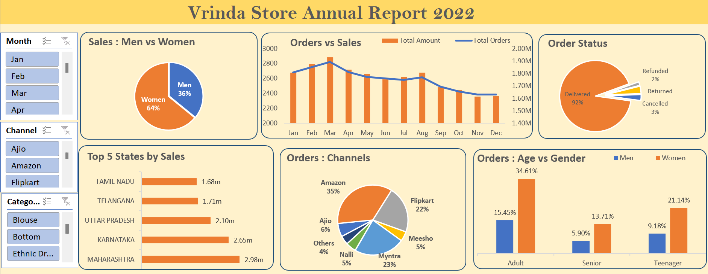

  
Data Analysis Project using Excel
=================================
The main goal was to perform data cleaning, pre-processing, feature creation, and build a final dashboard using Excel. Below is a detailed breakdown of the key stages involved:

Project Overview
----------------

*   **Data Cleaning**: Ensuring that the raw data is accurate, consistent, and free of errors by checking for missing values, duplicates, and outliers.
*   **Data Pre-processing**: Transforming the data to make it ready for analysis by handling missing values, normalizing data, and adjusting formats where needed.
*   **Pivot Tables**: Using pivot tables to summarize large datasets, allowing for better understanding and easier extraction of meaningful insights.
*   **Feature Engineering**: Creating new features or variables that can enhance the analysis, making the data more useful and insightful for further decision-making.
*   **Final Dashboard**: Building a user-friendly dashboard to visualize the results, helping to present key findings and insights effectively.

Tools and Technologies Used
---------------------------

*   Excel
*   Pivot Tables
*   Feature Engineering Techniques
*   Data Cleaning and Pre-processing Techniques

Conclusion
----------

This project helped me develop key skills in data analysis, including data cleaning, pre-processing, and visualization techniques. I’m excited to continue exploring data analysis and applying these techniques in future projects.

Contact
-------

If you have any questions or feedback about the project, feel free to reach out to me!

Project created and shared by \[Akash Anandani\].
